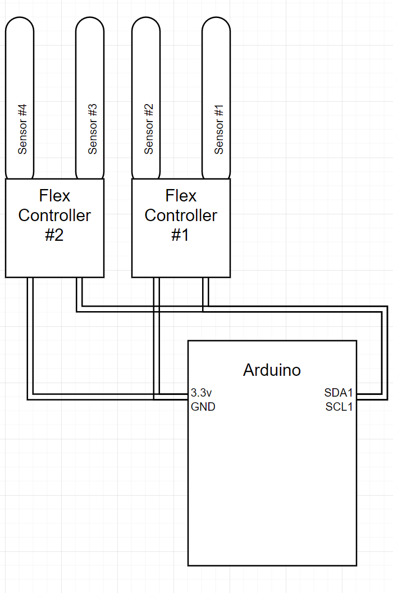

# Winter Projet 2020 - VR Glove
#### Bennett Espeland

## Objective

The goal of this project was to create a VR glove controller within the Unity environment.  The design uses an arduino microcontroller connected via USB and flex sensors.  The flex sensors are mounted onto a glove and are connected to the arduino via a I2C bus.  They are also powered by the Arduino 3.3v power.

## Result

## Instillation guide
Arduino:
- Install [Qwiic Flex Arduino Library](https://github.com/sparkfun/SparkFun_ADS1015_Arduino_Library)
- Upload code provided in the Arduino folder

Unity:
- Create a new empty Unity 3D Project
- Import the package (vrglove-full.unitypackage) located in the unity/package folder
- In project settings, set .NET Framework from 2.0 to 4.X
- Click on the serial game object and set the variable portName to the port the arduino is connected to

Running:
- Ensure the Arduino is connected and running
- Start the Unity player

## Parts list

- Two [Qwiic Flex Glove Controller](https://www.sparkfun.com/products/14666)
- Arduino
- PC

## Circuit Design

The circuit design is fairly simple.  It consists of connecting the I2C clock and data buses of the two Qwiic flex controllers and the Arduino along with 3.3v power and ground.

## Arduino code

The Arduino code uses the Qwiic Flex Arduino library to connect to the Qwiic Flex Controllers via I2C.  It returns a raw value for the flex sensor.  My goal was to have as little code running on the Arduino as possible so that it could send data to the PC.  So it only bound checks the flex sensors and passes the bounded data to the PC using serial communication. The Arduino acts as the Serial "server" and waits for the "client" (Unity) to send a character to tell it that is has successfully connected and is listening for data to be sent.  Then data is sent as quickly as possible to ensure low latency.

You will most likely need to re-tune the min/max for each flex sensor in order for the fingers to move accurately.

## Unity

The Unity code has to main elements, handControl and serial.  These are provided unpackaged in the Unity/Scripts folder for easy viewing purposes.  The handControl script takes the most recently received finger sensor reading and converts it to an percentage.  This percentage represents how curled the finger is from fully straight to fully curled.  It then applies this percentage to each finger individually based on that fingers corresponding sensor data.

The other script, serial, controls the communication with the Arduino.  It starts a serial communication with the Arduino and starts a thread to receive data on.  Using a ConcurrentQueue, we can transfer this data from the receive thread to the main Unity thread for use by the handControl script. Blocking communication is too slow and attempting non-blocking in the main Unity thread is not possible (Unity is picky about threading and accessing gameobjects outside the main thread).

## Challenges
The main challenges for this project were:
- flex sensor accuracy
- serial communication
- Unity threading

The Qwiic Flex Controller are very inconsistent in terms of what values they send to the Arduino.  I had to manually tune the flex sensors, but this process could be automated as well.  The larger issue was that some flex sensors have a deadband before the begin to sense that they have been bent.  The only remedy I found for this was testing multiple sensors and binning multiple sensors and only keeping the good ones.

The serial communication with Arduino gave me a bit of a struggle with how it acts upon initiating a serial connection.  Unbeknownst to me, when the serial communication successfully connects with the Arduino and receives its first character, it will reboot. This behavior was eventually discovered and remedied in the Unity code by sending a character to the Arduino, waiting a set amount of time for the Arduino to reboot, and then sending another character to signify that Unity is ready to receive data.

Unity does not allow accessing gameObjects outside of the main Unity thread.  This provided an issue where I needed to set the transforms for the finger joints (a gameobject) from a separate thread (serial receive thread).  Blocking communication was running too slow to get good fps and have the hand model update smoothly, so I had to use a separate thread.  C# provides the ConcurrentQueue that allows me to transfer values from the receive thread to a gameobject via variable locked dequeueing.

## Future Progress

Given more time, progression on this project can continue.  I was not yet able to achieve adding a VR camera to the Unity editor (instead I am currently using a fixed camera).  Nor was I able to integrate the Vive Trackers in Unity or my physical glove. These are definitely achievable future goals and would give me a more developed VR experience, attaching the Unity camera to the VR headset and attaching the hand model to a Vive Tracker.  In addition, I do not have tracking for the thumbs, as the bending of thumbs is slightly more complicated than that of fingers and does not readings as clearly as the other four digits do.  But with a better quality flex sensor (or potentially attaching multiple to the thumb), I believe it could also be achieved.
